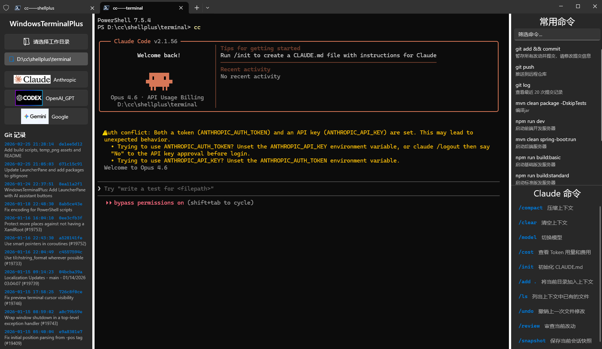

# Windows Terminal Plus

A modified version of [Windows Terminal](https://github.com/microsoft/terminal) with an integrated AI assistant launcher panel.

[中文说明](README_CN.md)

## Features

- **AI Assistant Launcher** — Left panel with quick-launch buttons for Claude Code, Codex CLI, and Gemini CLI. Select a working directory and launch with one click
- **Snippets Panel** — Upper-right area, customizable via `snippets.json` for frequently used commands (git operations, build commands, etc.), click to execute
- **AI Commands Panel** — Lower-right area, automatically switches command list based on the active AI assistant (e.g. `/compact`, `/clear`), configurable via `commands.json`
- **Git Log Viewer** — Bottom of the left panel shows recent commit history for the selected project
- **Portable Build** — Can be packaged as a standalone portable application, no installation required

## Download

Go to [Releases](https://github.com/Pulut/WindowsTerminalPlus/releases) to download the portable version. Extract the zip and run `WindowsTerminal.exe`.

## Prerequisites

This tool is a launcher UI and does not include the AI assistants themselves. You need to install and configure the AI assistants on your system first, making sure they work in cmd, PowerShell, or Windows Terminal.

### Install AI Assistants

| AI Assistant | Installation | Verification |
|-------------|-------------|-------------|
| Claude Code | `npm install -g @anthropic-ai/claude-code` | Type `claude` in terminal and it launches |
| Codex CLI | `npm install -g @openai/codex` | Type `codex` in terminal and it launches |
| Gemini CLI | `npm install -g @google/gemini-cli` | Type `gemini` in terminal and it launches |

After installation, configure the corresponding API Key or login credentials. Refer to each tool's official documentation for details.

### Custom Launch Commands

When you click the buttons on the left panel, the following commands are executed in the terminal:

| Button | Default Command |
|--------|----------------|
| Anthropic | `cc` |
| OpenAI_GPT | `codex` |
| Google | `gemini` |

If your command names are different (e.g. you use `claude` instead of `cc`), you need to modify the source code and rebuild.

File to modify: `src/cascadia/TerminalApp/LauncherPaneContent.cpp`

```cpp
// Claude Code launch command, change L"cc\r" to your command
void LauncherPaneContent::_claudeClick(const IInspectable&, const RoutedEventArgs&)
{
    _launchWithCommand(L"claude\r");  // Change to your actual command
}

// Codex CLI launch command
void LauncherPaneContent::_codexClick(const IInspectable&, const RoutedEventArgs&)
{
    _launchWithCommand(L"codex\r");
}

// Gemini CLI launch command
void LauncherPaneContent::_geminiClick(const IInspectable&, const RoutedEventArgs&)
{
    _launchWithCommand(L"gemini\r");
}
```

`\r` means auto-press Enter to execute. Do not remove it.

## Custom Command Configuration

There are two JSON config files in the portable directory (same level as `WindowsTerminal.exe`), editable with any text editor:

### snippets.json — Frequently Used Commands

Displayed in the upper-right area. Click to send directly to the current terminal.

```json
{
  "snippets": [
    {
      "name": "git push",
      "input": "git push\r",
      "description": "Push to remote repository"
    },
    {
      "name": "git add && commit",
      "input": "git add . && git commit -m \"\"",
      "description": "Stage all changes and commit, edit the commit message"
    }
  ]
}
```

| Field | Description |
|-------|-------------|
| `name` | Display name |
| `input` | Actual command to execute. Append `\r` to auto-press Enter, omit it to require manual Enter |
| `description` | Command description |

### commands.json — AI Assistant Commands

Displayed in the lower-right area. When you launch an AI assistant from the left panel, the corresponding command list is shown automatically. Click to send to the terminal.

```json
{
  "claude": [
    { "cmd": "/compact", "desc": "Compress context" },
    { "cmd": "/clear", "desc": "Clear context" },
    { "cmd": "/model", "desc": "Switch model" },
    { "cmd": "/cost", "desc": "View token usage and cost" }
  ],
  "codex": [
    { "cmd": "/compact", "desc": "Compress context" },
    { "cmd": "/new", "desc": "Clear conversation history" },
    { "cmd": "/diff", "desc": "Show file change diff" }
  ],
  "gemini": [
    { "cmd": "/compress", "desc": "Compress context" },
    { "cmd": "/stats", "desc": "View session statistics" },
    { "cmd": "/restore", "desc": "Rollback file changes" }
  ]
}
```

| Field | Description |
|-------|-------------|
| Top-level key | AI assistant name (`claude`, `codex`, `gemini`), corresponds to the launch command |
| `cmd` | Command to send |
| `desc` | Command description |

## Build from Source

### Prerequisites

- Windows 10 or later
- Visual Studio 2022 with C++ desktop development workload
- Windows SDK (10.0.22621.0 or later)

### Build Steps

1. Clone the repository:
   ```powershell
   git clone https://github.com/Pulut/WindowsTerminalPlus.git
   cd WindowsTerminalPlus
   ```

2. Use the one-click build script (compile + generate portable version):
   ```powershell
   .\scripts\build_all.ps1
   ```

   Or build manually:
   ```powershell
   & "C:\Program Files\Microsoft Visual Studio\2022\Community\MSBuild\Current\Bin\MSBuild.exe" `
       OpenConsole.slnx /p:Configuration=Release /p:Platform=x64 /m
   ```

3. The portable version is output to `scripts\portable_build\WindowsTerminalPortable\`.

### Build Scripts

| Script | Description |
|--------|-------------|
| `scripts\build_all.ps1` | One-click compile + generate portable version |
| `scripts\create_portable.ps1` | Generate portable version only (requires prior compilation) |
| `scripts\clean_build.ps1` | Clean intermediate build files (obj) to free disk space |

## Screenshot



## Credits

Based on [Microsoft Windows Terminal](https://github.com/microsoft/terminal), licensed under the MIT License.

## License

[MIT License](LICENSE)
